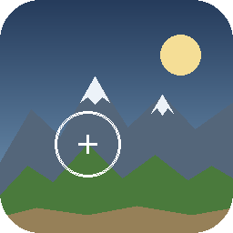

# LiteTerrain

A lightweight Godot 4 editor plugin for sculpting and generating heightmap-based terrain directly in the 3D viewport. No baking pipeline, no external dependencies — one dock, a `HeightMapShape3D`, and you're sculpting.

## Features

- **Sculpt brush** — raise, lower, and flatten terrain with a configurable radius/strength brush. Left-click to sculpt, mouse wheel to resize the brush.
- **Procedural generation** — one-click terrain from continental FBM + ridge noise: seed, scale, octaves, plains power curve, mountain amount, ridge sharpness, amplitude, and smoothing controls.
- **Chunked runtime renderer** — the included `map.gd` node renders the heightmap with LOD, frustum culling, horizon-based occlusion culling, and chunk streaming for large maps.
- **Terrain shader** — height/slope-based texturing (sand / grass / rock / snow zones) with an optional tiled texture overlay.
- Full undo/redo for both sculpting and generation.

## Installation

### From the Asset Library
Search for **LiteTerrain** in the Godot editor's AssetLib tab, install, then enable it in **Project > Project Settings > Plugins**.

### Manually
1. Copy `addons/LiteTerrain/` into your project's `addons/` directory.
2. Enable **LiteTerrain** in **Project > Project Settings > Plugins**.

## Quick start

1. Add a `StaticBody3D` to your scene and attach `addons/LiteTerrain/map.gd` to it.
2. Add a `CollisionShape3D` child and assign it a new `HeightMapShape3D` (set the map width/depth).
3. Add a `MeshInstance3D` child; assign `addons/LiteTerrain/terrain_shader.res` as its material for the built-in zone texturing.
4. Select the `StaticBody3D` — the **LiteTerrain** dock appears on the left.
5. Hit **🌍 Generate Terrain** for a procedural base, then hand-sculpt with Raise / Lower / Flatten.

See [`addons/LiteTerrain/README.md`](addons/LiteTerrain/README.md) for the full file-by-file breakdown.

## Compatibility

Godot 4.x. The plugin edits standard `HeightMapShape3D` data, so it composes with anything else that consumes heightmaps.

## License

[MIT](LICENSE) © MrKrob00
